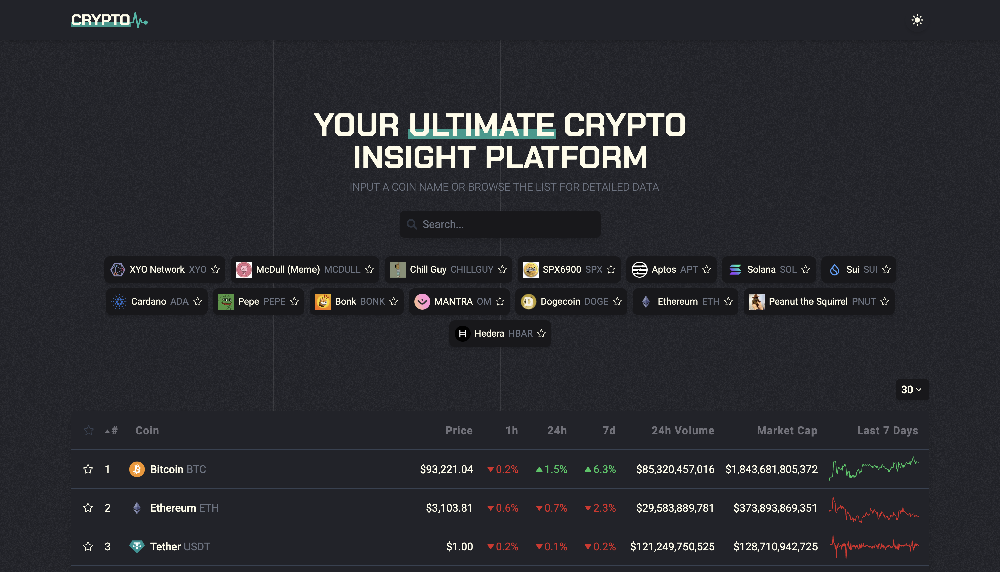
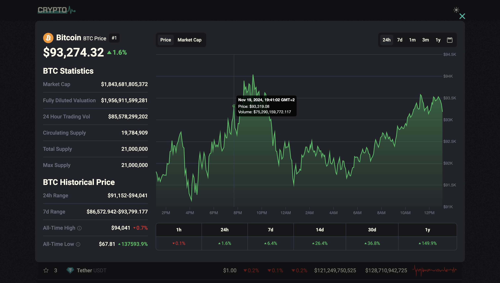

# Crypto Pulse
<p>
  
  
  
  
  
</p>

**Crypto Pulse** is a web application for tracking real-time cryptocurrency prices. Users can find specific coins through the search field or explore various coins in the main table, which provides quick information about popular cryptocurrencies. The application allows users to filter cryptocurrencies and add them to a favorites list, which will be saved even after the page is reloaded. By selecting a coin from the table or search results, users can view detailed information, including a price chart over a selected period.

You can view the live demo of the project at: [Crypto Pulse on Netlify](https://ccrypto-pulse.netlify.app)





### Key Features:
- Search for and view individual cryptocurrency information
- Filter cryptocurrencies and add them to a favorites list
- Display of price chart over selected time periods
- Custom date range selection through a calendar (e.g., 24 hours, 7 days, 1 month)

Data is provided by the **CoinGecko API**, ensuring accurate and up-to-date cryptocurrency market information.

## Installation

To run the project locally, follow these steps:

1. **Clone the repository**:
   ```bash
   git clone https://github.com/VanyaLyashuk/crypto-pulse.git
   cd crypto-pulse
2. **Create a** .env **file** in the project root with the following content:
	```bash
   COINGECKO_API_KEY="your_api_key_here"
**Note**: You can obtain a free API key from the [CoinGecko API](https://www.coingecko.com/en/api).

3. **Install dependencies and Netlify CLI**:	
	```bash
	npm install
	npm install -g netlify-cli
4. **Start the application**  using Netlify:	
	```bash
	netlify dev
The project will be available at http://localhost:8888.

**Note**: Netlify CLI allows you to run the project locally with serverless functions as they would work on deployment.

## License

This project is licensed under the MIT License. See the [LICENSE](https://opensource.org/licenses/MIT) file for more information.
